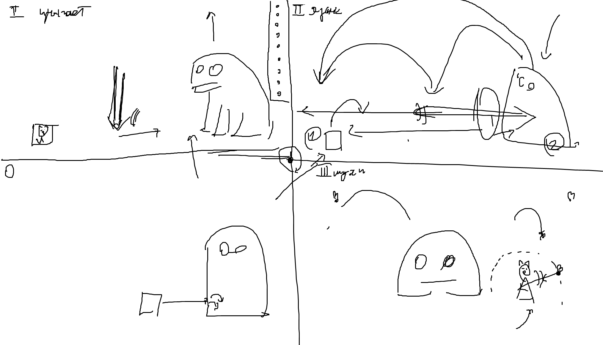

# Котик

Мы -- чёрный котик ведьмы, должны собирать всяких мышек, лягушек, насекомых для зелий.

Геймплей: Боссфайт с лягушками (и тд)

Минимальный контент:
- Один боссфайт (Лягухка)
    + Фон (бекграунд)
    + Котик
    + Лягуха
- Локация с ведьмой (где дают задание)

Максимальный контент:
- Боссфайт Лягухка
- Боссфайт Птичка
- Боссфайт Белочка
- Локация с ведьмой (где дают задание)
- Базовая локация (лобби), где мы выбираем куда идти

Мувсет котика:
- ходит (вправо/влево)
- прыжок (вверх)
- деш
- удар лапой - ближняя атака. Оно же блок
- ? взаимодействие лапой
- ? даблджамп
- ? воллджамп + воллы

Мувсет лягухи:
- Фаза 1
    + прыгает (сверху) -- атакует. Когда мы подходим к лягушке, она подпрыгивает куда-то вверх и через время приземляется (старается на игрока). В месте приземления сначала появляется тень. После падения лягушка несколько секунд ждёт чтобы её побили
- Фаза 2 -- лягушка сидит на одном из концов локации
    + прыгает на другой конец локации как только мы подходим
    + бьёт языком когда мы далеко (возможно, есть два удара -- верхний и нижний). Удар можно перепрыгнуть или отпаррировать -- в этот момент лягушка станится и позволяет себ ударить.
- Фаза 3 -- лягушка садится на центр локации и пускает мух
    + Мухи летают где-то вокруг, рандомно подлетая к игроку
    + Когда муха достаточно близко, она дешится в сторону игрока (наносит урон). В этот момент её можно убить, отпаррировав

